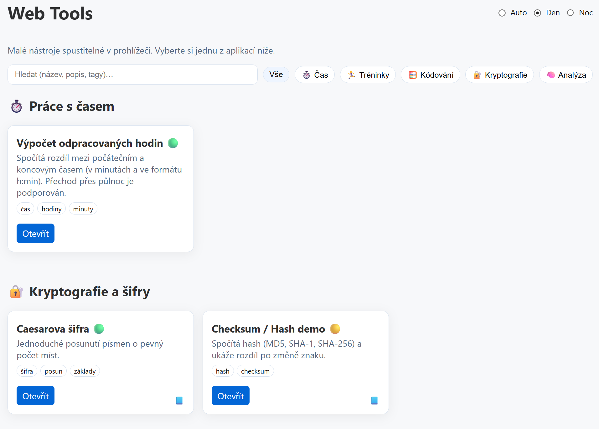

# web-tools



- [web-tools](#web-tools)
- [O nástrojích](#o-nástrojích)
- [Průvodce pro vývojáře](#průvodce-pro-vývojáře)
  - [Instalace Node.js](#instalace-nodejs)
    - [Pomocí winget](#pomocí-winget)
    - [Přidání do PATH](#přidání-do-path)
  - [Spouštění testů](#spouštění-testů)
    - [Pouze Vitest](#pouze-vitest)
  - [Spuštění v prohlížeči](#spuštění-v-prohlížeči)
    - [S podporou načítání skriptů (lokální server)](#s-podporou-načítání-skriptů-lokální-server)
    - [Otevírání v IDE](#otevírání-v-ide)
  - [Struktura projektu](#struktura-projektu)
  - [Jazyková podpora](#jazyková-podpora)
    - [HTML stránky](#html-stránky)
    - [`.MD` soubory](#md-soubory)
  - [Vyhledatelnost na Google](#vyhledatelnost-na-google)
    - [Sitemap](#sitemap)
    - [Open Graph meta tagy](#open-graph-meta-tagy)
    - [Registrace v Google Search Console](#registrace-v-google-search-console)

# O nástrojích

> [!question]
> Rozdělit `*_explain.md` na popis a příklady?

# Průvodce pro vývojáře

Níže jsou kroky, jak si projekt otestovat lokálně ve Windows pomocí PowerShellu.

## Instalace Node.js
Pokud ještě nemáte nainstalovaný Node.js (obsahuje npm), stáhněte LTS verzi z https://nodejs.org/ nebo použijte správce balíčků.

### Pomocí winget

V PowerShellu spusťte:
```powershell
winget install --id OpenJS.NodeJS.LTS -e
```

### Přidání do PATH

Pokud instalátor nainstaloval Node do `C:\Program Files\nodejs`, ale příkazy `node`/`npm` nejsou dostupné v terminálu, můžete tuto složku přidat do uživatelského PATH:

```powershell
# Získat současný uživatelský PATH
$userPath = [Environment]::GetEnvironmentVariable('Path','User')

# Pokud cesta ještě není přítomná, připojíme ji a uložíme
if ($userPath -notlike '*C:\Program Files\nodejs*') {
  $newUserPath = 'C:\Program Files\nodejs' + ';' + $userPath
  [Environment]::SetEnvironmentVariable('Path', $newUserPath, 'User')
  Write-Output 'Cesta k Node byla přidána do uživatelského PATH. Otevřete nové PowerShell okno.'
} else {
  Write-Output 'Cesta již byla v uživatelském PATH.'
}
```

Po provedení této změny zavřete a znovu otevřete PowerShell a ověřte instalaci:

```powershell
node -v
npm -v
```

## Spouštění testů
V kořenovém adresáři projektu spusťte:

```powershell
cd E:\Git\web-tools
npm install    # nebo 'npm ci' pokud máte package-lock.json
npm test
```

### Pouze Vitest
Pokud chcete nainstalovat pouze Vitest jako dev-dependenci a spustit testy:

```powershell
npm install --save-dev vitest@latest
npm test
```

Očekávaný výsledek: Vitest spustí testy z adresáře `tests/` a měly by projít (zelené).

## Spuštění v prohlížeči

Pro prohlížení nástrojů v prohlížeči otevřete `src/index.html`.

> [!warning]
> Některé funkce nemusí fungovat správně při přímém otevření souboru v prohlížeči kvůli omezením CORS a bezpečnostním politikám. Doporučuje se použít lokální HTTP server.

### S podporou načítání skriptů (lokální server)

Pro spuštění projektu v prohlížeči s podporou ES modulů použijte lokální HTTP server. Například:

```powershell
# Python 3
python -m http.server 8000 --directory src
```
- `src` je kořenový adresář webu (aby fungovaly relativní cesty).

[http://localhost:8000/](http://localhost:8000/) otevře hlavní stránku.

### Otevírání v IDE

VS Code rozšíření "Live Server" od Microsoftu umožňuje spustit lokální server přímo z editoru. Po instalaci rozšíření klikněte pravým tlačítkem na `src/index.html` a vyberte "Open with Live Server".

## Struktura projektu

Pro každou stránku:
- `*.explain.md` – vysvětlení nástroje v markdown formátu,
- HTML soubor `tool/<nazev>_tool.html`,
  - obsahuje `<link>` na CSS a `<script type="module" src="../js/pages/..."></script>`,
- soubor s javascriptovým kódem `js/pages/<nazev>.js`,
  - obsahuje inline `<script type="module">` logiku,
- metadata v `tools.json`.

```text
src/
├── assets/               # obrázky, ikony
├── js/
│   ├── core/             # jádro aplikace (společné funkce pro nástroje)
│   ├── ui/               # obecné UI komponenty (tlačítka, dialogy, notifikace)
│   ├── vendor/           # externí knihovny (např. QRCode.js)
│   └── pages/            # skripty pro jednotlivé nástroje
├── i18n/                 # překladové JSON soubory
│   ├── cs.json
│   └── en.json
├── css/                  # styly
│   └── style.css
├── tool/                 # HTML stránky nástrojů
│   ├── *_explain.md/     # vysvětlení nástroje
│   └── *_tool.html/      # HTML stránka nástroje
├── tools.json            # metadata nástrojů
└── index.html            # hlavní stránka generovaná z tools.json
```

## Jazyková podpora

Více jazyků je podporováno pomocí jednoduchého i18n modulu, který načítá překladové JSON soubory a nahrazuje texty na stránce.

```powershell
npm run check-i18n
```

Skript zkontroluje, zda všechny jsou správně vytvořeny překladové klíče v `src/js/i18n/`.

### HTML stránky
Jeden HTML, přepínání textů v JS:
– všechny stránky sdílí layout a logiku,
– texty se tahají z cs.json / en.json,
– site-header má přepínač jazyka.

I18n modul `src/js/ui/i18n.js`

Lehký modul, který:
- rozhodne jazyk (cs/en) z `?lang=cs|en v URL`,
- načte příslušný *.json,
- najde všechny [data-i18n] a přepíše textContent.

### `.MD` soubory
Více jazyků: `?lang=cs` → načti `explain.cs.md`, jinak `explain.en.md`.

## Vyhledatelnost na Google

### Sitemap
```powershell
# výchozí (root URL '/')
npm run gen-sitemap

# nebo specifikovat produkční URL
npm run gen-sitemap -- --baseUrl=https://example.com/
# nebo přes env
$env:SITEMAP_BASE = 'https://example.com/'; npm run gen-sitemap
```

### Open Graph meta tagy

```html
<link rel="canonical" href="https://elpytel.github.io/web-tools/">
<meta property="og:title" content="Web Tools – malé nástroje v prohlížeči">
<meta property="og:description" content="Praktické online nástroje: šifry, převodníky, MIDI editor...">
<meta property="og:type" content="website">
<meta property="og:url" content="https://elpytel.github.io/web-tools/">
```

### Registrace v Google Search Console

👉 [https://search.google.com/search-console/](https://search.google.com/search-console/)

Postup:
1️⃣ Zvol „URL Prefix“ a vlož:

`https://elpytel.github.io/web-tools/`

2️⃣ Ověř vlastnictví:

Nahráním HTML souboru do rootu repa nebo vložením <meta> tagu do <head> sekce `src/index.html`.

3️⃣ Po ověření → klikneš Index → Požádat o indexaci